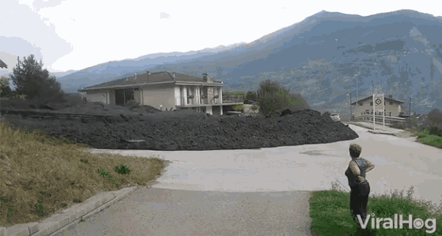
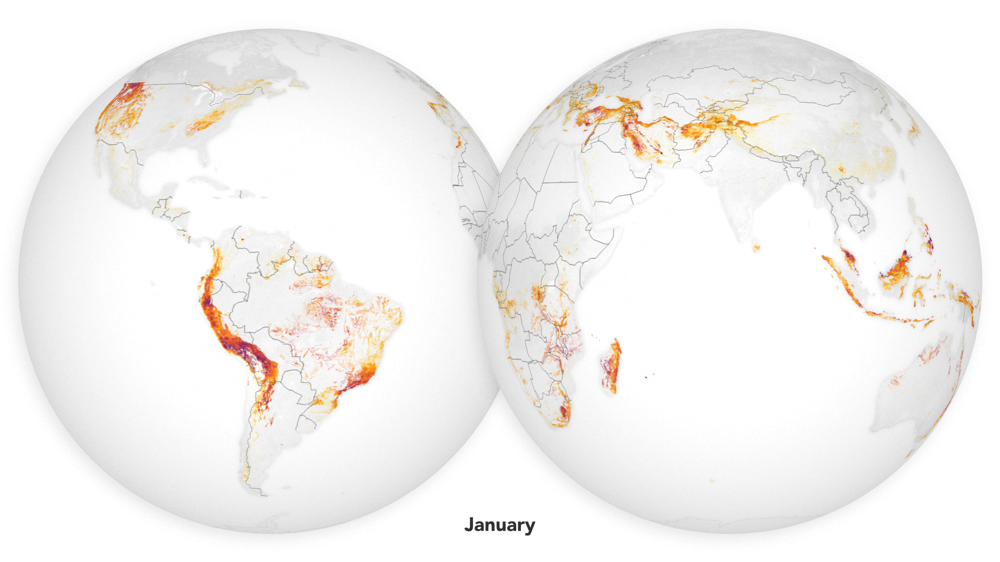

## What is a Landslide?


A landslide occurs when masses of rock, debris, or earth move down a slope. It is a type of "mass wasting," referring to the downward movement of soil and rock due to gravity. Landslides are categorized into five movement types: falls, topples, slides, spreads, and flows, which can involve different geological materials such as bedrock, debris, or soil. Common examples include debris flows (often called mudslides) and rockfalls.


## Why Study Landslides?

Landslides are a significant geological hazard affecting nearly every state in the United States. As populations expand into hilly or mountainous areas, understanding the risks posed by landslide hazards becomes crucial. It enables cities, towns, and counties to plan land use and design new construction and infrastructure to minimize the impact and reduce costs associated with living in landslide-prone areas.

While many physical causes of landslides cannot be eliminated, proper geologic investigations, sound engineering practices, and enforcing land-use management regulations can help mitigate these risks. Studying landslides also provides valuable insights into their causes, movement patterns, soil characteristics, associated geology, and the locations most susceptible to these events.





# Landslide Risk Prediction using Logistic Regression

## Project Overview

This project aims to develop a logistic regression classifier 
for predicting landslide risks using historical environmental data and real-time inputs. 
The model incorporates critical features such as rainfall levels, soil 
moisture, slope gradients, and seismic activity to 
classify areas into low-risk or high-risk zones. 

By leveraging API-fed real-time environmental 
data, the classifier adapts dynamically, 
enabling semi-real-time predictions for disaster 
preparedness and risk assessment.

## Goals
1. Build a logistic regression classifier to predict landslide risks.
2. Integrate real-time environmental data using APIs from sources like NASA GPM and USGS.
3. Develop a dashboard for visualizing predictions and environmental conditions.
4. Provide an open-source framework for landslide risk forecasting.

## Project Features

### Historical Data Integration
- Utilizes static datasets (e.g., landslide occurrences, terrain features) for model training.
- Features include rainfall intensity, soil saturation, slope gradient, and seismic activity.

### Real-Time API Integration



- Fetches live environmental data from APIs:
  - **NASA GPM:** Precipitation data.
  - **USGS:** Seismic activity updates.
  - **NOAA:** Wind-driven rainfall metrics.

### Logistic Regression Classifier
- A machine learning model trained to classify landslide risk.
- Includes dynamic threshold tuning based on real-time updates.

## How Logistic Regression Fits In

Logistic regression works well for classifying landslide risk based on historical patterns and static environmental conditions (e.g., precipitation, slope gradient, soil type). It helps identify high-risk zones but lacks the ability to adjust dynamically based on real-time data.

## How Real-Time Geospatial Data Enhances It

To overcome this limitation, NASA’s LHASA system and the MERRA-2 dataset can be integrated to provide the model with real-time meteorological inputs:

- **Global Precipitation Measurement (GPM)**: Provides live rainfall data.
- **Wind-Driven Rainfall (WDR)**: Helps determine terrain-specific impacts.
- **DEM (Digital Elevation Model) Data**: Allows slope aspect calculations.
- **Antecedent Soil Moisture**: Enhances predictions by considering how much water is retained in soil.

## Proposed Hybrid Modeling Workflow

### Static Logistic Regression Classifier
- Trained on historical landslide occurrences, terrain slope, soil type, and past rainfall data.
- Produces baseline probability estimates for landslide susceptibility.

### Real-Time Data Layer
- Uses GPM, MERRA-2, and terrain elevation data to update rainfall intensity, wind direction, and soil saturation levels.
- Computes dynamic probability adjustments based on live environmental changes.

### Final Hazard Prediction
- Logistic regression provides the core classification.
- Live data dynamically refines thresholds, adjusting real-time risks based on rainfall severity.

## Outcome

This hybrid approach creates a semi-real-time landslide prediction system, making it more actionable for disaster response and early warning systems.

### Interactive Dashboard
- Visualizes live landslide predictions.
- Displays real-time rainfall and hazard indicators for specific regions.

📂 natural-hazards-classifier
 ├── 📂 assets          # Static resources
 ├── 📂 data            # Historical and real-time datasets
 ├── 📂 src             # Scripts for preprocessing, training, and API calls
 ├── 📂 notebooks       # Jupyter notebooks for exploration and testing
 ├── 📜 README.md       # Project overview
 ├── 📜 requirements.txt # Python libraries and dependencies
 ├── 📜 main.py         # Main script for classification and dashboard updates

 ## Data Sources

### Static Datasets
- **Historical Landslide Occurrences**:
  - [USGS Landslide Inventory](https://www.usgs.gov/tools/us-landslide-inventory-and-susceptibility-map)
  - [Globally Distributed Coseismic Landslide Dataset (GDCLD)](https://essd.copernicus.org/articles/16/4817/2024/)
- **Terrain Features**:
  - [USGS Digital Elevation Models (DEMs)](https://www.usgs.gov/the-national-map-data-delivery/gis-data-download)
  - [Global Terrain Data from ESSD](https://essd.copernicus.org/articles/16/4817/2024/)
- **Soil Type**:
  - [ISRIC SoilGrids](https://www.isric.org/explore/soil-geographic-databases)
  - [USGS Soil Properties Dataset](https://www.usgs.gov/data/soil-properties-dataset-united-states)
- **Past Rainfall Data**:
  - [NASA GPM Historical Data](https://appliedsciences.nasa.gov/sites/default/files/2025-03/Landslides_Part3_Final.pdf)
  - [NOAA Climate Data](https://www.ncei.noaa.gov/cdo-web/)

### Dynamic Datasets
- **Real-Time Geospatial Data**:
  - [NASA SMAP Soil Moisture Data](https://smap.jpl.nasa.gov/)
  - [Global Precipitation Measurement (GPM)](https://gpm.nasa.gov/)
- **Meteorological Inputs**:
  - [MERRA-2 Dataset](https://gmao.gsfc.nasa.gov/reanalysis/MERRA-2/)
  - [Wind-Driven Rainfall Metrics from NOAA](https://www.ncdc.noaa.gov/)
- **Seismic Activity**:
  - [USGS Earthquake Data](https://earthquake.usgs.gov/data/)

## Technologies & Tools

- **Programming Language:** [Python](https://www.python.org/)
- **Machine Learning Library:** [scikit-learn](https://scikit-learn.org/)
- **Data Manipulation:** [pandas](https://pandas.pydata.org/), [NumPy](https://numpy.org/)
- **Visualization Tools:** [Matplotlib](https://matplotlib.org/), [Streamlit](https://streamlit.io/), [Dash](https://plotly.com/dash/), [HoloViz](https://holoviz.org/)
- **API Integration:** [requests](https://docs.python-requests.org/)
- **Dashboard Development:** Streamlit, Dash, or HoloViz (tbd)
- **Interactive Development Environments:** [Jupyter Notebooks](https://jupyter.org/), [Google Colab](https://colab.research.google.com/)

## Installation

1. **Clone the repository:**
   ```bash
   git clone https://github.com/username/natural-hazards-classifier.git

2. **Navigate to the project directory:**
   ```bash
   cd natural-hazards-classifier
   
3. **Install dependencies:**
   ```bash
   pip install -r requirements.txt

# Usage
1. Train the Model Run the training script to prepare the logistic regression classifier:
   ```bash
   python src/train_model.py

3. Fetch Real-Time Data Integrate real-time environmental data:
   ```bash
     python src/fetch_real_time_data.py

5. Visualize Predictions Launch the dashboard to view hazard risk predictions:
   ```bash
     streamlit run main.py  # Replace with `panel serve` or `dash-app.py` if using HoloViz or Dash

## Future Enhancements

- Expand the model to include other natural hazards like floods and wildfires.
- Incorporate a deep learning approach for improved real-time predictions.
- Develop a GIS-based visualization tool for interactive hazard mapping.

---

## Contributions

Contributions are welcome! Please open an issue or submit a pull request for any bug fixes, feature additions, or improvements.

---

## License

This project is licensed under the [MIT License](https://opensource.org/licenses/MIT).


## Credits

### GIFs:
- [boisestatepublicradio](https://www.boisestatepublicradio.org/idaho-news/2017-04-12/scary-mudslide-caught-on-tape-on-idaho-u-s-highway-95)
- [Giphy](https://giphy.com/gifs/iEakcXftNNZRe)
- [NASA Earth Observatory](https://www.earthobservatory.nasa.gov/images/92018/predicting-landslide-hazards-in-near-real-time)

### Information Sources:
- [USGS - What is a Landslide and What Causes One?](https://www.usgs.gov/faqs/what-a-landslide-and-what-causes-one)
- [USGS - Why Study Landslides?](https://www.usgs.gov/faqs/why-study-landslides)


